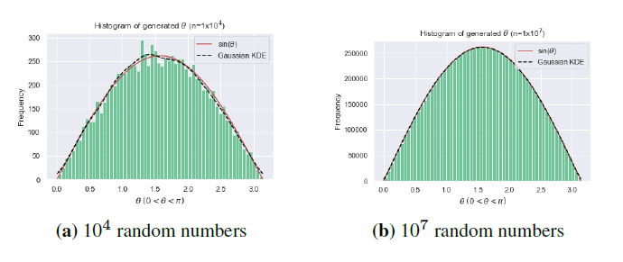
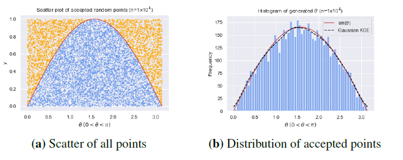
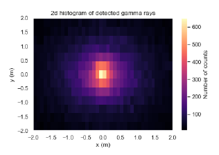
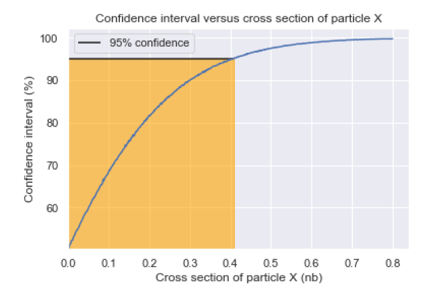

# Monte Carlo Methods and Particle Detection

Hi there!

This is a refactor of a computational assignment on Monte Carlo Methods, particularly to their application in modern
practical particle physics. Find attached my report.

# Table of Contents
1. [Task 1](#task1)
   1. [Task 1.1 -Inverse Sampling](#inverse)
   2. [Task 1.2 - Rejection Sampling](#reject)
2. [Task 2 - Particle detection and distribution imaging](#task2)
3. [Task 3 - Statistical analysis with Monte Carlo methods](#task3)
3. [Set up the repo](#setup)
---

## Task 1 <div id='task1'/>


The general ask for this task is to measure the area under a sine curve, if only computers knew how to integrate...

### Inverse sampling <div id='inverse'/>

The first method we try is inverse sampling, which goes like:

1. For a given function _f(x)_, determine the integrated inverse function _f<sup> -1</sup>(x)_.
2. Generate randomly generated numbers and feed them through _f<sup> -1</sup>(x)_
3. Congratulations you now have an _f(x)_ probability distribution!

We try this on the sine function _f(θ)_  = _sin(θ)_, with _f<sup> -1</sup>(θ)_ = _arccos(1 - θ)_ and we obtain:



### Reject sampling <div id='reject'/>

But what if we to take the shotgun approach? Rejection sampling involves random points generation and checking to see if
they lie 'within' the target distribution.

An intuitive example of is a grid with a circle on it. Say we through loads of darts (randomly please, no bullseyes), at
the grid, we would see some lie within the circle, and some outside. If we measured the proportion of points within the
circles boundary, we have an estimate for the circles area respective to the grid. A simple measure of the circles
radius and grid size gives us pi!

The code for a quarter circle is here:

```
import numpy.random as r
# Imagine a quarter circle stretching to the side of a grid where the radius r=1 obeys r^2 = x^2 + y^2
samples = 10000
rand_xy = r.uniform(0, 1, (samples, 2))  # grid (x=0->1, y=0->1)
percentage_in_quarter_circle = sum([1 for x, y in rand_xy if x**2 + y**2 < 1]) / samples
print(f"pi = {percentage_in_quarter_circle * 4} with {samples} samples")  # since area = pi * r^2 and r = 1
```

Anyway, this was applied to sine curves for resulting in:



Look at the histogram, pretty sine-like! I love how visual this method is.

---

## Task 2 <div id='task2'/>

### Detector imaging of a spontaneous decaying particle

This involved the spontaneous decays of a particle some distance from a target and a detector detecting detections some
distance away.

Random decays were modelled with an exponential distribution and using some needlessly complicated coordinate
transformations, these random decays are mapped to a square cartesian grid representing our noble particle detector. The
nitty-gritty details of modelling a finite resolution 2 dimensional detector and seeing how the distribution becomes
imaged was the highlight in this task.



---

## Task 3 <div id='task3'/>

### Statistical analysis with Monte Carlo methods

This aimed to measure the confidence interval of that a particles cross-section (see chance for particles to collide) by
generation of pseudo-experiments.

Pseduo-experiments contain randomised parameters and a number are generated for some specific hypothesised
cross-section. A confidence is generated for that set of pseudo-experiments that says the true cross-section lies
somewhere beneath this value and the process is repeated. Eventually we are able to plot confidence interval against
cross-section.

There is lots of random number generation in this task, especially given that the background needs to be accounted for (
and certain values have uncertainty). For this reason, bulk random number generation via numpy is utilised heavily,
this _highly_ improved the performance of the program.

We were most interested in a 95% confidence interval so that was plotted:



---

## Set up the repo <div id='setup'/>

- Clone the project, navigate into the project scope and create/activate a virtual environment
  with `python -m venv venv` and `source /venv/<os_dependent_path_to_activate>/activate`.


- There you should be able to run `pip setup .` or if that fails `pip setup -r requirements.txt`.


- Run `python montecarlopd/main.py` to start exercising that pseudo-RNG!